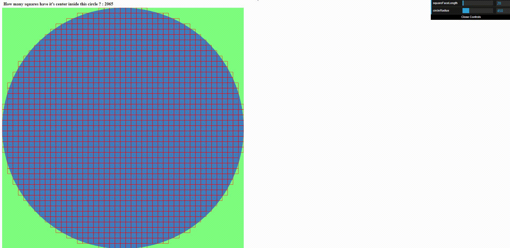

# SquaresInCircleCalculator

This web tool calculate visually how many squares have their center inside a defined circle.
Circle radius and square size can be modified in real time.

# Installation
Just open HTML page in your browser

# Contributing
Pull requests are welcome. 

# Demo

